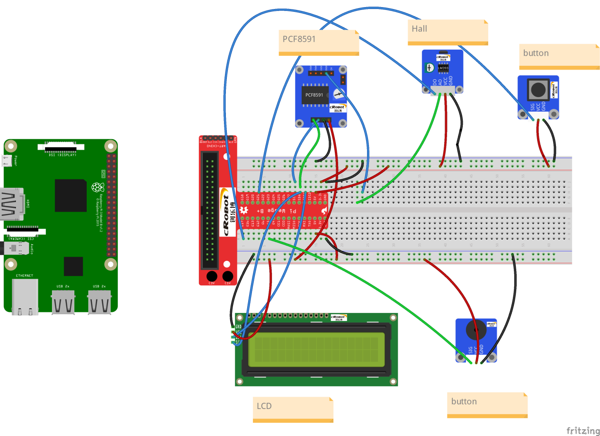

# 基于树莓派的门卫机器人

## 环境配置

操作系统：`raspbian`

库：`face_recognition` `dlib` `opencv-python`

## 人脸识别

本项目使用`face_recognition`库进行人脸识别训练，参考`cv.py`文件中代码，需要在项目根目录中放置一张`me.jpg`的人脸图片作为训练集，并且设置代码中的人名，即可进行准确度非常不高的人脸识别，嘻嘻

## 模块使用

- PCF8591
- 有源蜂鸣器
- LCD1602
- 开关元件
- 霍尔传感器
- USB摄像头

